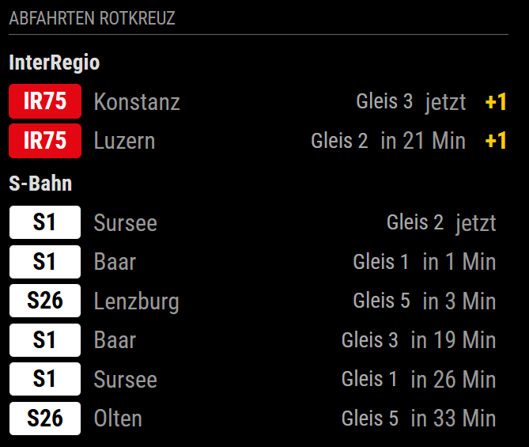

# 🚆 MMM-sbb

A **modern [MagicMirror²](https://magicmirror.builders/)** module that displays **Swiss public transport departures** — including SBB, IR, IC, S-Bahn, and more — with **grouping** and **authentic SBB-style line colours**.

Data source: [transport.opendata.ch](https://transport.opendata.ch)

---

## ✨ Features

- 📍 **Next departures** for a chosen station (e.g., `Zürich HB`)
- 🎯 **Optional destination filter** (e.g., only show trains to `"Bern"`)
- 🗂 **Group by train type** (S / IR / IC / RE / …)
- 🎨 **SBB-like line colours** for instant recognition
- ⏱ **Relative** (`in X min`) or **absolute** (`HH:MM`) time display
- 🚉 **Track** and **delay** information

---

## ⚙️ Configuration Options

Add the module to your `config.js`:

```js
{
  module: "MMM-sbb",
  position: "top_left",
  config: {
    station: "Zürich HB",       // Required
    to: "Bern",                 // Optional — use quotes if destination has spaces
    maxDepartures: 8,
    updateInterval: 60000,      // in ms
    timeFormat: "relative",     // "relative" or "absolute"
    showLine: true,
    showTrack: true,
    showDelay: true,
    groupByType: true
  }
}
```

| Option           | Type    | Default   | Description |
|------------------|---------|-----------|-------------|
| `station`        | string  | —         | Station name or ID (**required**) |
| `to`             | string  | —         | Destination filter (**optional**) — *use quotes if it contains spaces* |
| `maxDepartures`  | number  | `8`       | Number of rows to display |
| `updateInterval` | number  | `60000`   | Refresh interval in ms |
| `timeFormat`     | string  | `"relative"` | `"relative"` = `in X min`, `"absolute"` = `HH:MM` |
| `showLine`       | boolean | `true`    | Show line badge |
| `showTrack`      | boolean | `true`    | Show platform |
| `showDelay`      | boolean | `true`    | Show delay minutes if available |
| `groupByType`    | boolean | `true`    | Group by S/IR/IC/RE/… |

---

## 🎨 Styling

You can customise colours in `styles.css`.  
The module assigns CSS classes based on transport type:

```css
.type-s     { /* S-Bahn */ }
.type-ir    { /* InterRegio */ }
.type-ic    { /* InterCity */ }
.type-re    { /* RegioExpress */ }
.type-ec    { /* EuroCity */ }
.type-rjx   { /* Railjet Express */ }
.type-r     { /* Regio */ }
.type-bus   { /* Bus */ }
.type-tram  { /* Tram */ }
.type-other { /* Other */ }
```

## 📌 Notes

- Uses the [transport.opendata.ch Stationboard API](https://transport.opendata.ch/v1/stationboard) — **no API key required**.
- To include buses or trams, remove or adjust the `transportations[]` filter in `node_helper.js`.

---

## 📷 Visual Example

Here’s how **MMM-sbb** looks in action on a MagicMirror² setup:



---

## 💡 Tip

If your destination contains spaces (e.g., `Zürich Flughafen`), **wrap it in quotes** in your config:

```js
to: "Zürich Flughafen"
```